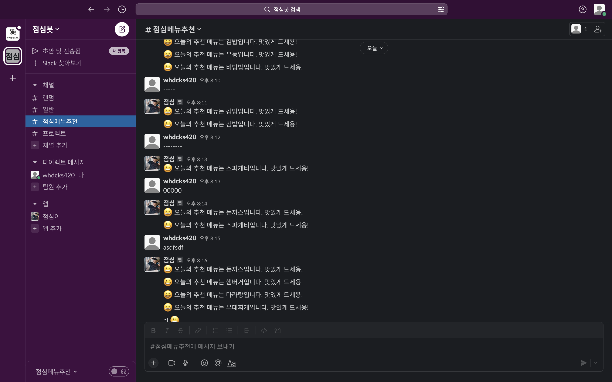

# 점심이 - bot

매일먹는 점심 오늘은 무엇을 먹지 선택하기 힘든 사람들을 위한 랜덤 점심 선택 및 점심 알리미 봇

```Spring Boot```
를 이용해 제작한 Slack 점심 알리미 봇입니다.



Gradle 설정 정보

```java
dependencies{
        implementation'org.springframework.boot:spring-boot-starter'
        compileOnly'org.projectlombok:lombok'
        annotationProcessor'org.projectlombok:lombok'
        testImplementation'org.springframework.boot:spring-boot-starter-test'

        // Slack
        implementation'org.springframework.boot:spring-boot-starter-web'
        implementation'com.squareup.okhttp3:okhttp:4.10.0'
        implementation'com.slack.api:bolt-servlet:1.27.2'
}
```

@Scheduled / cron을 이용하여 매일 정오에 알람이 발송 되도록 하였습니다.

```java
private static final String LUNCH_ALERT_TIMER="0 * * * * *";

@Scheduled(cron = LUNCH_ALERT_TIMER)
public void todayLunchRecommendMenu() {
        slackLunchService.sendLunchMessage();
}
```

메뉴 설정 방식 -> 한식, 중식, 양식, 일식중 랜덤으로 픽 
```java
public enum Menu {
KOREAN(List.of("라면", "부대찌개", "비빔밥", "김밥")),
JAPANESE(List.of("초밥", "우동", "돈까스")),
WESTERN(List.of("햄버거", "샌드위치", "스파게티")),
CHINESE(List.of("짜장면", "짬뽕", "볶음밥", "마라탕"));

    private final List<String> foods;

    Menu(List<String> foods) {
        this.foods = foods;
    }

    private static final List<Menu> VALUES = List.of(values());
    private static final int SIZE = VALUES.size();
    private static final Random RANDOM = new Random();

    public static String recommendMenu() {
        List<String> foods = VALUES.get(RANDOM.nextInt(SIZE)).foods;
        return foods.get(RANDOM.nextInt(foods.size()));
    }
}
```