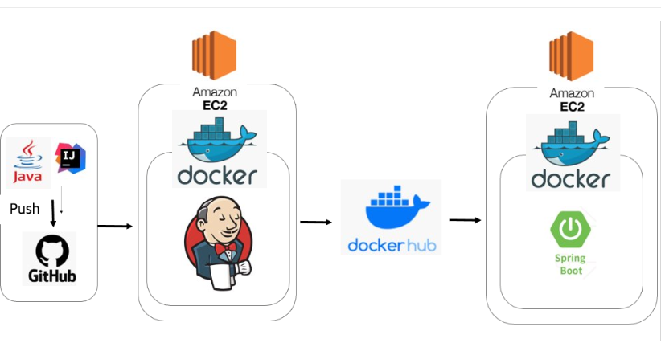

# 점심이 - bot

매일먹는 점심 오늘은 무엇을 먹지 선택하기 힘든 사람들을 위한 랜덤 점심 선택 및 점심 알리미 봇

서비스 구조

* Github-Webhook을 이용하여 push시 AWS EC2 서버 2대를 운영하여 젠킨스와 도커를 이용한 CI/CD를 구축하여 자동 빌드와 배포 구현해보았습니다.
  

``Spring Boot 와 Slack-api, 날씨 -api를 접목하여``제작한 점심 알리미 봇입니다.

**구현 스펙**
  * java11
  * Spring boot
  * gradle
  * jenkins
  * docker
  * aws ec2
<div>
        
</div>

**설정 정보**

```java
dependencies{
        implementation'org.springframework.boot:spring-boot-starter'
        compileOnly'org.projectlombok:lombok'
        annotationProcessor'org.projectlombok:lombok'
        testImplementation'org.springframework.boot:spring-boot-starter-test'

        // Slack
        implementation'org.springframework.boot:spring-boot-starter-web'
        implementation'com.squareup.okhttp3:okhttp:4.10.0'
        implementation'com.slack.api:bolt-servlet:1.27.2'
        }
```

Spring에서 제공하는 Scheduled / cron을 이용하여 매일 정오에 알람이 발송 되도록 하였습니다.

```java
private static final String LUNCH_ALERT_TIMER="0 0 12 * * *";

@Scheduled(cron = LUNCH_ALERT_TIMER)
public void todayLunchRecommendMenu(){
        slackLunchService.sendLunchMessage();
        }
```

메뉴 설정 방식 -> 처음에는 단순 무작위성 랜덤 추첨을 할까 생각하다, 현재 지역날씨 정보를 받아와 맞추워 강수, 온도에 따라 음식을 분리하여 추천해주는 식의 서비스 로직으로 구성해보았습니다.

```java
        KOREAN(List.of("라면","부대찌개","비빔밥","김밥"),"clear"),
        JAPANESE(List.of("초밥","우동","돈까스"),"clear"),
        WESTERN(List.of("햄버거","샌드위치","스파게티"),"clear"),
        CHINESE(List.of("짜장면","짬뽕","볶음밥","마라탕"),"clear"),

        RAIN(List.of("전","오뎅탕"),"rain"),
        SNOW(List.of("붕어빵","오뎅탕"),"snow");

private final List<String> foods;
private final String weatherStatus;

        Menu(List<String> foods,String weatherStatus){
        this.foods=foods;
        this.weatherStatus=weatherStatus;
        }

private static final Random RANDOM=new Random();

public static String recommendMenu(String weatherStatus){
        List<Menu> foods=Arrays.stream(Menu.values()).filter(value->value.weatherStatus.equals(weatherStatus)).collect(Collectors.toList());
        Menu menu=foods.get(RANDOM.nextInt(foods.size()));
        return menu.foods.get(RANDOM.nextInt(menu.foods.size()));
        }
```


